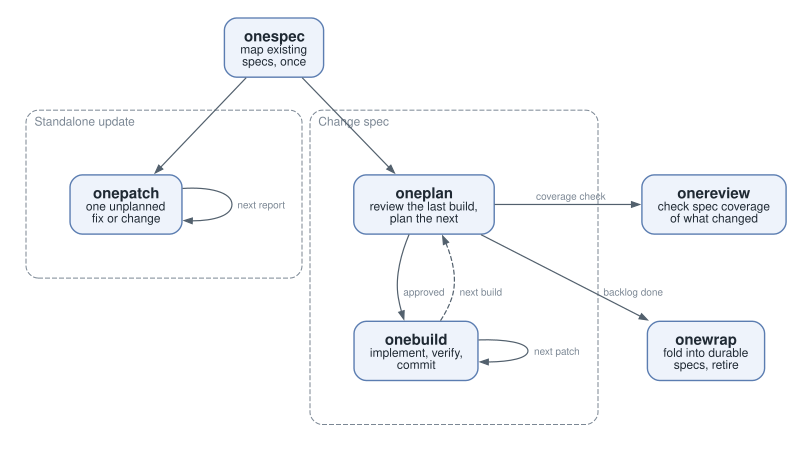

# OneSpec user guide

OneSpec is a lightweight spec-driven development toolkit for a developer
working with coding agents. Plain-prose specs state what the product should
do, and OneSpec keeps them current as the product changes:

- **Specs that stay true.** Each change is written up while it is built, and
  its lasting rules are folded back into the product's specs when it is
  implemented.
- **Light by design.** One prose file per change; a bug fix is a single
  patch.
- **One step at a time.** Only the next increment is planned in detail, and
  each plan starts from a review of the one before.
- **Not done until proven.** Every build records the evidence that it
  delivered what it set out to.

OneSpec ships as six agent skills: instructions your coding agent loads when
you invoke one. They run in Claude Code and Codex, and in any host that reads
a standard skills directory. Your specs are ordinary Markdown files in your
repository.

## Install

```sh
npx skills add SashaOv/onespec
```

In Claude Code you can instead add the repository as a plugin marketplace:

```
/plugin marketplace add SashaOv/onespec
/plugin install onespec@onespec
```

Either route installs the same six skills. Update and remove them with the
tool you installed them with. Invoke a skill by name; in Claude Code that is
`/oneplan` and so on.

## Work at different levels

OneSpec gives each level of work its own path, from a small fix to a feature or milestone:

| Work | Path |
|---|---|
| A bug, a failing test, a red CI job, a small change | `onepatch`: one verified patch |
| A planned change | a change spec and the build loop: `oneplan`, `onebuild` |
| Product milestone | durable specs, coverage review, folding: `onespec`, `onereview`, `onewrap` |


<picture>
  <source media="(prefers-color-scheme: dark)" srcset="levels-dark.svg">
  
</picture>

Start with **onepatch**. It works in any repository, with no spec. 
As more changes accumulate, you may want to combine them into a change spec and start the **oneplan - onebuild** loop. Durable specs are what the
loop grows into.


## Fix or change something now: `onepatch`

Run `onepatch` with a description of the problem, a failing test, or a failed
GitHub Actions job.

1. **Diagnose.** It reproduces the problem where it can and presents the root
   cause (or, for a change, the design), the evidence for it, what it does
   and does not affect, and the remedy.
2. **Confirm.** When the remedy is small and obvious it goes ahead. Otherwise
   it asks you first, offering the full cycle, a quick fix, or another
   direction.
3. **Fix.** It writes a test that fails, makes it pass, and runs the whole
   suite. For a defect it then names the spec or process change that would
   have caught it. A quick fix skips the new test and that last step.
4. **Deliver.** A failed CI job is delivered as a pull request, driven until
   every blocking check is green. Anything else stays uncommitted in your
   working tree with a proposed commit message. You can choose the other
   delivery either way.

## Build a planned change

### The change spec

A **change spec** describes one change while it is built. It is a single
Markdown file in `docs/todo/`, in this order:

1. **Goal and design**: what the change is and how it works.
2. **Facts**: what was verified, with dates.
3. **Builds**: one record per build, oldest first.
4. **Backlog**: one-line items, unordered, always last.

Write the goal, the design and a backlog of one-liners. That is all the
change spec needs before the first planning turn.

### Builds and patches

A **build** delivers one improvement you can inspect. It consists of
**patches**: a patch is one coherent, verified change, and inside a build it
lands as exactly one commit.

Builds are numbered when they are planned, never earlier, under a short tag
for the change spec. The first build of a spec tagged `LC` is `LC1`; its
patches are `LC1.1`, `LC1.2` and so on, and each commit subject starts with
that name, so the plan and the history read the same. Backlog items carry no
numbers.

Every build record starts with its status:

- `Status: planned, awaiting author checkpoint`
- `Status: planned, approved <date>`
- `Status: executed, pending author verification`
- `Status: implemented <date> (commits LC1.*)`

### The loop

1. **Plan**: run `oneplan`. It reviews the previous build against its record
   and reruns its acceptance check, then plans the next build from the
   backlog: the improvement, how it will be verified, and its patches. It
   writes the scriptable part of that check into your tests before anything
   is built, and stops for you.
2. **Approve**: read the plan; ask for changes, or approve it.
3. **Build**: run `onebuild`. For each patch it implements the change,
   checks that the whole suite is green and, where a test can show the
   change, that the patch's test failed before and passes after. It checks
   that every changed line serves the patch's stated purpose, then commits.
   When the last patch is in, it runs the acceptance check once over the
   final tree and records the result in the change spec.
4. **Repeat** until the backlog holds nothing you want to build.

### Evidence

A build's **acceptance check** says how you can tell its improvement is
real, and its record keeps the evidence once it runs: what was run, on which
tree, with what result.

A passing suite is not enough for a claim about the outside world. If a
build says a package is published or a provider now calls your service, the
check observes that it happened; a stand-in that only exercises your own
code does not count. When the real effect cannot be observed, the build
stops and reports it rather than marking it done.

Some checks only you can make: a write to your own account, a payment, a
look at a device. The plan lists them as **author actions**, and the build
stays `executed, pending author verification` until you report them.

## Grow into durable specs

A **durable spec** describes the product as currently intended. It is
maintained as the product evolves, and it is the source of truth for
intent: code that disagrees with it is a defect, fixed like any other bug.
When the intent itself changes, the durable spec changes, through a change
spec.

### Writing specs

A spec is Markdown prose. Each heading starts a **chunk**: the heading names
it, and the text below it, down to the next heading of the same or higher
level, is its content. There are no requirement IDs; the heading is the
name, so choose it with care.

A spec that refines another names it in front matter:

```yaml
---
refines: docs/spec.md
---
```

These `refines:` links form the spec graph. A short root spec states the
product's goals; larger products refine it into subsystems and behaviors.

Code and tests name the chunk they implement or verify with a `(spec)`
reference in a comment or docstring:

```python
def test_expired_reset_link_is_rejected():
    """(spec) Reset token rules"""
```

When two specs share a heading, add the parent heading:
`(spec) Authentication / Reset token rules`.

### Coverage

Run `onespec` once to map the specs a project already has, and `onereview`
after changes. Neither changes any files. Both report each chunk as:

- **Covered**: implementation and tests both found;
- **Partially covered**: one of the two found;
- **Gap**: neither found;
- **Not applicable**: a principle or umbrella section that maps to no code.

They also work the other way, reporting behavior in the code that no spec
describes, and they suggest the `(spec)` references to add.

### Folding a change back

When a change is done, run `onewrap` on its change spec. It reviews
everything the change touched and stops on any gap until you fix it or
accept it by name. It then shows the fold into the parent spec as a diff:
the lasting behavioral rules go in, while implementation detail and build
records stay behind. Once you confirm, it applies the fold and retires the
change spec, keeping its record readable in the project's history.

## The skills

| Skill | When | What it does |
|---|---|---|
| `onepatch` | any time | Takes one unplanned fix or change from report to delivery. |
| `oneplan` | each build | Reviews the previous build and plans the next one, then stops for your approval. |
| `onebuild` | each build | Carries out an approved plan, one verified commit per patch, and records the evidence. |
| `onespec` | once per project | Maps existing specs and their coverage. Changes no files. |
| `onereview` | after changes | Checks spec coverage of what changed. Changes no files. |
| `onewrap` | end of a change | Folds a finished change spec into its parent and retires it. |

## Example

A change spec at its first planning turn:

```markdown
---
refines: docs/spec.md
---

# Library card renewal

## Goal

Members renew an expiring card online instead of at the desk.

## Facts

Verified 2026-10-01: the card service accepts `PATCH /cards/{id}` with an
`expires` field.

## Builds

### LC1 — A member renews their own card

Status: planned, awaiting author checkpoint

**Material improvement.** ...

**Acceptance check.** ...

**Patches.**

- [ ] **LC1.1** — ...
- [ ] **LC1.2** — ...

## Backlog

- Email a reminder two weeks before a card expires.
- Staff renew a card on a member's behalf.
```

## Glossary

- **Durable spec**: a spec that describes the product as currently intended
  and is maintained as it evolves.
- **Change spec**: a spec for one change while it is built; retired when its
  lasting content is folded into the durable specs.
- **Build**: one inspectable improvement, planned and approved before it
  runs.
- **Patch**: one coherent, verified change; inside a build, exactly one
  commit.
- **Acceptance check**: how a build's improvement is verified.
- **Evidence**: the recorded result of running the acceptance check.
- **Defect**: code or tests that disagree with the spec they reference.
